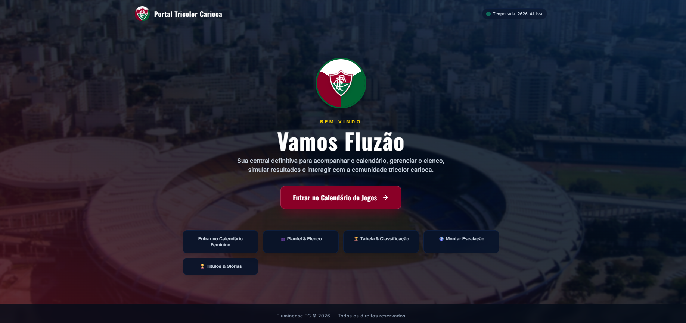

# <h1 align="center"> Projeto Calendário do Fluminense </h1>

Projeto desenvolvido por William Ramos  

  <a href="#-tecnologias">Tecnologias</a>&nbsp;&nbsp;&nbsp;|&nbsp;&nbsp;&nbsp;
  <a href="#-projeto">Projeto</a>&nbsp;&nbsp;&nbsp;|&nbsp;&nbsp;&nbsp;
  <a href="#-layout">Layout</a>&nbsp;&nbsp;&nbsp;|&nbsp;&nbsp;&nbsp;
  <a href="#memo-licença">Licença</a>

  

 

  

## 🚀 Tecnologias

Esse projeto foi desenvolvido com as seguintes tecnologias:

- [x] HTML, CSS e JS
- [x] Git e GitHub

## 💻 Projeto

Projeto sobre o Calendário de jogos do Fluminense  2026.

- [Acesse o projeto finalizado, online](https://github.com/williamsramos/fluminense-calendario)
- [Acesse o site do projeto finalizado, online](https://williamsramos.github.io/fluminense-calendario)
- [Acesse o site do projeto finalizado, online](https://fluminense-calendario.vercel.app)

## :memo: Licença

Esse projeto está sob a licença MIT.

---

Feito após curso da ♥ por William Ramos 👋
